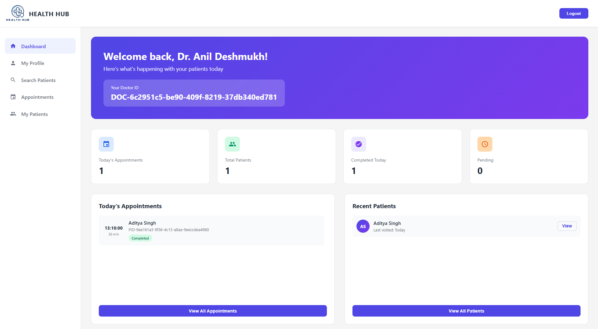

# 🏥 HealthHub

**Digital Health Record Management System for Migrant Workers in Kerala**

*Smart India Hackathon 2025 - College Mini Project*


---

## 📋 Table of Contents

- [Overview](#overview)
- [Problem Statement](#problem-statement)
- [Features](#features)
- [Tech Stack](#tech-stack)
- [Installation](#installation)
- [Environment Setup](#environment-setup)
- [Project Structure](#project-structure)
- [Screenshots](#screenshots)
- [Support](#support)

---

## 🌟 Overview

HealthHub is a comprehensive digital health record management system developed for **Smart India Hackathon 2025** as a college mini project. This platform addresses the critical need for maintaining health records of migrant workers in Kerala, who often serve as carriers for infectious diseases, posing serious public health risks to local communities.

---

## 🎯 Problem Statement

**Problem Statement ID:** 2S083  
**Title:** Digital Health Record Management System for migrant workers in Kerala aligned with sustainable development goals  
**Organization:** Government of Kerala  
**Department:** Health Service Department  
**Category:** Software  
**Theme:** MedTech / BioTech / HealthTech

### The Challenge

Kerala hosts a significant migrant population lacking comprehensive health record systems. These individuals often serve as carriers for infectious diseases, posing serious public health risks to local communities. A dedicated software solution for maintaining migrant health records would:

- ✅ Support Sustainable Development Goal (SDG) achievement
- ✅ Prevent disease transmission
- ✅ Enhance public health surveillance
- ✅ Assist in disease elimination
- ✅ Ensure fair and impartial healthcare access

---

## ✨ Features

### 👤 For Migrant Workers (Patients)

1. **Registration & Authentication**
   - Secure email-based registration with OTP verification
   - Login with email and password
   - Unique Patient ID generation

2. **Profile Management**
   - Complete personal details (name, age, gender, contact information)
   - Medical details (blood group, medical history)
   - Upload past medical reports (PDF support)

3. **Medical Records**
   - View all uploaded medical reports
   - Download medical reports
   - View new reports uploaded by doctors after appointments

4. **Find Doctors**
   - Browse available doctors
   - View doctor profiles (specialization, experience, fees, hospital)
   - Contact doctors via email or phone for appointments

5. **Dashboard**
   - View unique Patient ID
   - Access to profile and medical records
   - Quick navigation to all features

### 👨‍⚕️ For Doctors

1. **Registration & Authentication**
   - Secure email-based registration with OTP verification
   - Login with email and password
   - Unique Doctor ID generation

2. **Profile Management**
   - Personal details (name, contact information)
   - Professional details:
     - Specialization
     - Degree/Qualification
     - Hospital/Clinic name and address
     - Years of experience
     - Consultation fees

3. **Patient Management**
   - Search patients using Patient ID
   - View complete patient records
   - Access patient medical history and reports

4. **Appointment Management**
   - Add appointments using Patient ID
   - Select appointment date and time
   - Delete appointments if cancelled
   - Mark appointments as completed

5. **Medical Records**
   - Upload new medical reports after appointments
   - Add notes for patients

6. **Dashboard**
   - Today's appointments overview
   - Total patients count
   - Completed and pending appointments
   - Recent patients list
   - View unique Doctor ID

7. **My Patients**
   - View all patients who have visited
   - Patient records with complete details
   - Total visits and visit history

---

## 🛠️ Tech Stack

### Frontend
- **HTML5** - Semantic markup
- **CSS3** - Modern styling and responsive design
- **JavaScript (ES6+)** - Client-side functionality

### Backend
- **Node.js** - Runtime environment
- **Express.js** - Web application framework
- **RESTful API** - API architecture

### Database
- **MySQL** - Relational database
- **MySQL2** - Database driver with connection pooling

### Authentication & Security
- **bcrypt** - Password hashing
- **express-session** - Session management
- **OTP Verification** - Email-based verification

### Email Service
- **Nodemailer** - Email sending
- **Gmail SMTP** - Email service provider

### File Handling
- **Multer** - File upload middleware
- **PDF Support** - Medical report uploads

### Additional Libraries
- **express-validator** - Input validation
- **body-parser** - Request body parsing
- **cors** - Cross-origin resource sharing
- **dotenv** - Environment variables management

---

## 📦 Installation

### Prerequisites
- Node.js (v14 or higher)
- MySQL (v8.0 or higher)
- npm or yarn
- Gmail account for email service

### Setup Steps

1. **Clone the repository**
```bash
git clone https://github.com/yourusername/healthhub.git
cd healthhub
```

2. **Install dependencies**
```bash
cd backend
npm install
```

3. **Set up database**
   - Create MySQL database named `healthhub`
   - Import the SQL file:
   ```bash
   mysql -u root -p healthhub < "SQL Query/HealthHub.sql"
   ```

4. **Configure environment variables**
   - Create `.env` file in `backend` folder
   - Copy from `.env.example` and update values

5. **Start the server**
```bash
npm run dev
```

The application will run on `http://localhost:5001`

---

## 🔧 Environment Setup

Create a `.env` file in the `backend` directory:

```env
# Email Configuration
EMAIL_USER=your_email@gmail.com
EMAIL_PASSWORD=your_gmail_app_password

# Database Configuration
DB_HOST=localhost
DB_USER=root
DB_PASSWORD=your_database_password
DB_NAME=healthhub
DB_CONNECTION_LIMIT=10
DB_CONNECT_TIMEOUT=60000
```

### Gmail App Password Setup

1. Go to [Google Account Settings](https://myaccount.google.com/)
2. Enable **2-Step Verification** under Security
3. Generate **App Password** for Mail
4. Use this password in `EMAIL_PASSWORD`

---

## 📁 Project Structure

```
healthhub/
├── backend/
│   ├── config/
│   │   ├── constants.js
│   │   └── database.js
│   ├── controllers/
│   │   ├── appointment.controller.js
│   │   ├── auth.controller.js
│   │   ├── doctor.controller.js
│   │   ├── document.controller.js
│   │   ├── forgotPassword.controller.js
│   │   ├── patient.controller.js
│   │   └── user.controller.js
│   ├── middleware/
│   │   ├── auth.js
│   │   ├── errorHandler.js
│   │   └── upload.js
│   ├── routes/
│   │   ├── appointment.routes.js
│   │   ├── auth.routes.js
│   │   ├── doctor.routes.js
│   │   ├── document.routes.js
│   │   ├── forgotPassword.routes.js
│   │   ├── patient.routes.js
│   │   └── user.routes.js
│   ├── utils/
│   │   └── helpers.js
│   ├── validators/
│   │   └── validators.js
│   ├── .env
│   ├── .env.example
│   ├── index.js
│   ├── package.json
│   └── package-lock.json
├── assets/
│   ├── eye-hide.png
│   ├── eye-show.png
│   ├── Forgot Password 3D Model.png
│   ├── Health Hub Logo - Main.png
│   ├── Health Hub Logo - Title.png
│   ├── Login 3D Model.png
│   └── Register 3D Model.png
├── css/
│   ├── appointments.css
│   ├── doctor-dashboard.css
│   ├── doctor-directory.css
│   ├── doctor-profile.css
│   ├── forgot-password.css
│   ├── login.css
│   ├── medical-reports.css
│   ├── patient-dashboard.css
│   ├── patient-profile.css
│   ├── patients.css
│   ├── register.css
│   └── search-patients.css
├── html/
│   ├── appointments.html
│   ├── doctor-dashboard.html
│   ├── doctor-directory.html
│   ├── doctor-profile.html
│   ├── forgot-password.html
│   ├── login.html
│   ├── medical-reports.html
│   ├── patient-dashboard.html
│   ├── patient-profile.html
│   ├── patients.html
│   ├── register.html
│   └── search-patients.html
├── js/
│   ├── appointments.js
│   ├── doctor-dashboard.js
│   ├── doctor-directory.js
│   ├── doctor-profile.js
│   ├── forgot-password.js
│   ├── login.js
│   ├── medical-reports.js
│   ├── patient-dashboard.js
│   ├── patient-profile.js
│   ├── patients.js
│   ├── register.js
│   └── search-patients.js
├── SQL Query/
│   └── HealthHub.sql
├── .gitignore
└── README.md
```

---

## 📸 Screenshots

### Doctor Dashboard

*Doctor dashboard showing today's appointments, total patients, and statistics*

### Patient Records

*Patient dashboard displaying unique patient ID, profile access, and medical records*

### Login Page
*Secure login interface with OTP verification*

### Registration
*User registration with email verification*

### Patient Profile
*Complete profile with personal and medical details*

### Doctor Profile
*Professional profile with specialization and credentials*

### Find Doctors
*Browse and search doctors by specialty*

### Medical Reports
*Upload and manage medical documents*

---

## 📞 Support

For support and queries:
- **GitHub:** [Create an issue](https://github.com/yourusername/healthhub/issues)
- **Email:** your.email@example.com

---

## 🙏 Acknowledgments

- **Smart India Hackathon 2025** - For the opportunity
- **Government of Kerala** - Health Service Department
- **College** - For project guidance and support

---

<p align="center">
  <b>Built for Smart India Hackathon 2025</b><br>
  Made with ❤️ for better healthcare management in Kerala
</p>

<p align="center">
  <i>Empowering migrant workers with accessible healthcare records</i>
</p>
