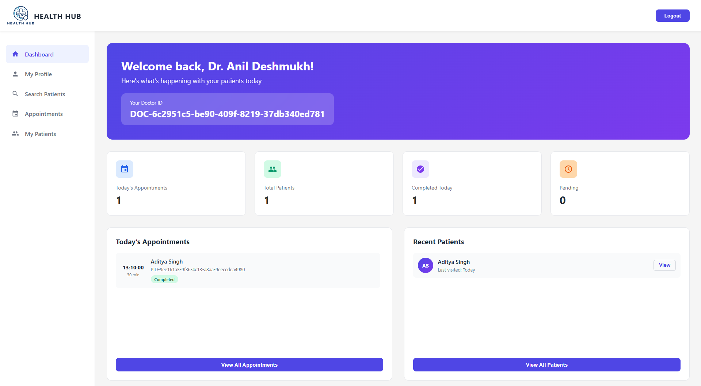
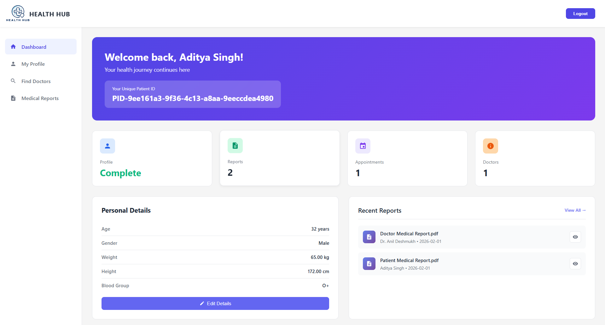

# 🏥 HealthHub

**Digital Health Record Management System for Migrant Workers in Kerala**

*Smart India Hackathon 2025 - College Mini Project*


---

## 📋 Table of Contents

- [🌟 Overview](#-overview)
- [🎯 Problem Statement](#-problem-statement)
- [📸 Screenshots](#-screenshots)
- [✨ Features](#-features)
- [🛠️ Tech Stack](#️-tech-stack)
- [📦 Installation](#-installation)
- [🔧 Environment Setup](#-environment-setup)
- [📁 Project Structure](#-project-structure)
- [🔌 API Reference](#-api-reference)
- [🗄️ Database Tables](#️-database-tables)
- [📞 Support](#-support)

---

## 🌟 Overview

HealthHub is a comprehensive digital health record management system developed for **Smart India Hackathon 2025** as a college mini project. This platform addresses the critical need for maintaining health records of migrant workers in Kerala, who often serve as carriers for infectious diseases, posing serious public health risks to local communities.

---

## 🎯 Problem Statement

**Problem Statement ID:** 25083  
**Title:** Digital Health Record Management System for migrant workers in Kerala aligned with sustainable development goals  
**Organization:** Government of Kerala  
**Department:** Health Service Department  
**Category:** Software  
**Theme:** MedTech / BioTech / HealthTech

### The Challenge

Kerala hosts a significant migrant population lacking comprehensive health record systems. These individuals often serve as carriers for infectious diseases, posing serious public health risks to local communities. A dedicated software solution for maintaining migrant health records would:

- ✅ Support Sustainable Development Goal (SDG) achievement
- ✅ Prevent disease transmission
- ✅ Enhance public health surveillance
- ✅ Assist in disease elimination
- ✅ Ensure fair and impartial healthcare access

---

## 📸 Screenshots

### 🩺 Doctor Dashboard


### 🧑‍💼 Patient Dashboard


---

## ✨ Features

### 👤 For Migrant Workers (Patients)

1. **Registration & Authentication**
   - Secure email-based registration
   - JWT-based login with HTTP-only cookie sessions
   - Unique Patient ID generation

2. **Profile Management**
   - Personal details: name, age, gender, weight, height, contact info
   - Medical details: blood group, allergies, current medications, medical history
   - Emergency contact information
   - Upload past medical reports (PDF support)

3. **Medical Records & Documents**
   - View all uploaded reports (from both patients and doctors)
   - Download and delete medical documents

4. **Appointments**
   - Book appointments with doctors (online via Stripe or cash)
   - View all upcoming and past appointments with status
   - Real-time slot availability per doctor per date

5. **Find Doctors**
   - Browse all available doctors
   - View doctor profiles: specialization, experience, fees, clinic address

### 👨‍⚕️ For Doctors

1. **Registration & Authentication**
   - Secure registration restricted to `@healthhub.com` email addresses
   - JWT-based login with HTTP-only cookie sessions
   - Unique Doctor ID generation

2. **Profile Management**
   - Personal and professional details
   - Specialization, degree, experience, consultation fees, clinic address, bio

3. **Patient Management**
   - Search patients by Patient ID
   - View complete patient records: medical history, allergies, medications
   - Access all documents uploaded for a patient

4. **Appointment Management**
   - Create, complete, and delete appointments
   - Upload documents and add notes when completing appointments
   - Record cash payments received

5. **Dashboard**
   - Today's total, completed, and pending appointments
   - Total unique patients seen
   - Recent patients list with quick-view

### 💳 Payments

- **Online (Stripe Checkout):** Patient pays before booking; appointment is created only after payment confirmation
- **Cash:** Patient records cash intent; doctor confirms receipt
- Idempotency checks prevent duplicate bookings and payments

### 🔐 Authentication & Security

- Passwords hashed with **bcrypt** (10 salt rounds)
- Sessions via **JWT** stored in HTTP-only cookies
- Doctor login restricted to `@healthhub.com` email addresses
- Role-based access control

### 📧 Forgot Password

- 6-digit OTP sent via Gmail SMTP
- OTP valid for 5 minutes, max 3 verification attempts

---

## 🛠️ Tech Stack

| Layer | Technology |
|-------|------------|
| Frontend | HTML5, CSS3, JavaScript (ES6+) |
| Backend | Node.js, Express.js |
| Database | MySQL, MySQL2 |
| Auth | bcryptjs, jsonwebtoken, HTTP-only cookies |
| Payments | Stripe Checkout |
| Email | Nodemailer, Gmail SMTP |
| File Uploads | Multer (memory storage) |
| Other | dotenv, cors, uuid, express-validator |

---

## 📦 Installation

### Prerequisites
- Node.js (v14 or higher)
- MySQL (v8.0 or higher)
- Gmail account for email service
- Stripe account for online payments

### Steps

1. **Clone the repository**
```bash
git clone https://github.com/yourusername/healthhub.git
cd healthhub
```

2. **Install dependencies**
```bash
cd backend
npm install
```

3. **Set up the database**
```bash
mysql -u root -p healthhub < "SQL Query/HealthHub.sql"
```

4. **Configure environment variables** — see [Environment Setup](#-environment-setup)

5. **Start the server**
```bash
npm run dev
```

The application will run on `http://localhost:5001`

---

## 🔧 Environment Setup

Create a `.env` file in the `backend` directory:

```env
EMAIL_USER=your_email@gmail.com
EMAIL_PASSWORD=your_gmail_app_password

DB_HOST=localhost
DB_USER=root
DB_PASSWORD=your_database_password
DB_NAME=healthhub
DB_CONNECTION_LIMIT=10
DB_CONNECT_TIMEOUT=60000

JWT_SECRET=your_jwt_secret
JWT_EXPIRY=7d
COOKIE_MAX_AGE=604800000

STRIPE_SECRET_KEY=sk_test_...
STRIPE_PUBLISHABLE_KEY=pk_test_...

CLIENT_URL=http://localhost:5001
```

### Gmail App Password Setup
1. Go to [Google Account Settings](https://myaccount.google.com/)
2. Enable **2-Step Verification** under Security
3. Generate an **App Password** for Mail
4. Use this password in `EMAIL_PASSWORD`

---

## 📁 Project Structure

```
healthhub/
├── backend/
│   ├── config/
│   ├── controllers/
│   ├── middleware/
│   ├── routes/
│   ├── utils/
│   ├── validators/
│   ├── .env
│   ├── index.js
│   └── package.json
├── assets/
├── css/
├── html/
├── js/
├── SQL Query/
│   └── HealthHub.sql
├── .gitignore
├── README.md
└── LICENSE
```

---

## 🔌 API Reference

All routes are prefixed with `/api`. Protected routes require a valid JWT in the `authToken` cookie.

### Auth — `/api/auth`

| Method | Endpoint | Access | Description |
|--------|----------|--------|-------------|
| POST | `/register` | Public | Register a new patient or doctor |
| POST | `/login` | Public | Login and receive JWT cookie |
| POST | `/logout` | Protected | Clear auth cookie |

### User — `/api/user`

| Method | Endpoint | Access | Description |
|--------|----------|--------|-------------|
| GET | `/me` | Protected | Get current logged-in user |
| GET | `/verify` | Protected | Verify JWT token validity |

### Forgot Password — `/api/forgot-password`

| Method | Endpoint | Access | Description |
|--------|----------|--------|-------------|
| POST | `/send-otp` | Public | Send 6-digit OTP to registered email |
| POST | `/verify-otp` | Public | Verify OTP (max 3 attempts, 5 min expiry) |
| POST | `/reset-password` | Public | Reset password after OTP verification |

### Doctor — `/api/doctor`

| Method | Endpoint | Access | Description |
|--------|----------|--------|-------------|
| GET | `/profile` | Doctor | Get own profile |
| PUT | `/profile` | Doctor | Create or update doctor profile |
| GET | `/all` | Patient | List all doctors |
| GET | `/search-patient/:patientId` | Doctor | Search patient by Patient ID |
| GET | `/dashboard-stats` | Doctor | Today's appointments and totals |
| GET | `/recent-patients` | Doctor | Last 3 recent patients |

### Patient — `/api/patient`

| Method | Endpoint | Access | Description |
|--------|----------|--------|-------------|
| GET | `/profile` | Patient | Get full profile |
| PUT | `/profile` | Patient | Update profile with optional file upload |
| GET | `/dashboard-stats` | Patient | Appointments, reports, doctors count |
| GET | `/documents` | Patient | All documents |
| GET | `/documents/:documentId/download` | Patient | Download a document |
| GET | `/medical-report/download` | Patient | Download profile report |
| DELETE | `/medical-report` | Patient | Delete profile report |
| GET | `/all-records` | Doctor | All patient records for a doctor |

### Appointments — `/api/appointments`

| Method | Endpoint | Access | Description |
|--------|----------|--------|-------------|
| POST | `/create` | Doctor | Create appointment by Patient ID |
| GET | `/all` | Doctor | Get all doctor's appointments |
| POST | `/complete` | Doctor | Complete appointment with optional file upload |
| DELETE | `/:appointmentId` | Doctor | Delete or cancel appointment |
| PUT | `/:appointmentId/done` | Doctor | Mark as done |
| POST | `/book` | Patient | Book appointment |
| GET | `/booked-slots` | Patient | Check slot availability |
| GET | `/my` | Patient | Get patient's own appointments |

### Documents — `/api/documents`

| Method | Endpoint | Access | Description |
|--------|----------|--------|-------------|
| POST | `/upload/:patientId` | Doctor | Upload document for a patient |
| GET | `/:patientId` | Doctor/Patient | List patient's documents |
| GET | `/:patientId/:documentId/download` | Doctor/Patient | Download specific document |

### Payments — `/api/payments`

| Method | Endpoint | Access | Description |
|--------|----------|--------|-------------|
| POST | `/create-checkout-session` | Patient | Create Stripe Checkout session |
| POST | `/verify-checkout-session` | Patient | Verify payment and create appointment |
| POST | `/record-cash` | Doctor | Confirm cash received |
| GET | `/:appointmentId` | Protected | Get payment for an appointment |
| POST | `/patient-cash` | Patient | Record cash intent before visit |

---

## 🗄️ Database Tables

| Table | Description |
|-------|-------------|
| `users` | All users (patients and doctors) with hashed passwords |
| `patient_profiles` | Extended patient info, medical history, profile report |
| `doctor_profiles` | Specialization, degree, fees, address, bio |
| `appointments` | Appointment records with status and payment info |
| `patient_documents` | Binary document storage for patient files |
| `appointment_documents` | Documents attached to specific appointments |
| `patient_records` | Doctor–patient relationship with visit counts |
| `payments` | Payment records for online and cash transactions |

---

## 📞 Support

For support and queries:
- **GitHub:** [Prasad Nayak](https://github.com/PrasadNayak01)
- **Email:** worknayakprasad@gmail.com

---

## 🙏 Acknowledgments

- **Smart India Hackathon 2025** — For the opportunity
- **Government of Kerala** — Health Service Department
- **College** — For project guidance and support

---

<p align="center">
  <b>Built for Smart India Hackathon 2025</b><br>
  Made with ❤️ for better healthcare management in Kerala
</p>

<p align="center">
  <i>Empowering migrant workers with accessible healthcare records</i>
</p>